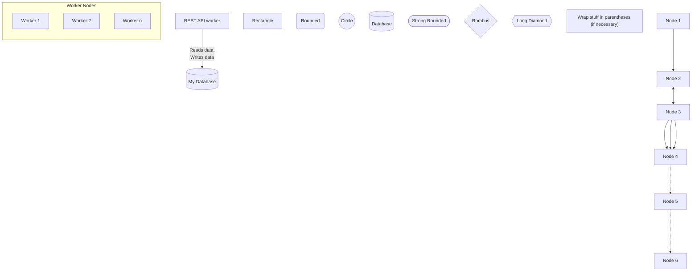
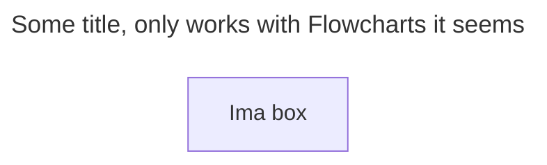

# Mermaid Hello
Mermaid renders nicely ad-hoc in GitHub Markdown on GitHub and in VSCode.
Better than `PlantUML`, sometimes compatible with `PlantUML`, sometimes just as hideous.

## Graphs

## Flowcharts

